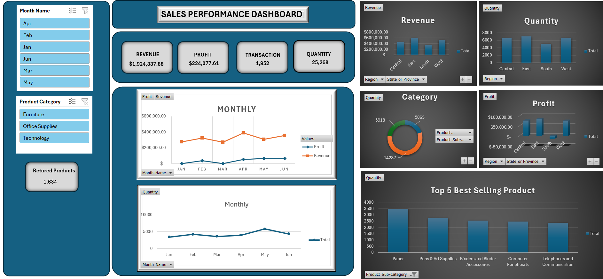

# Business Sales Analysis & Interactive Performance Dashboard — Excel

Most sales spreadsheets answer one question: how much did we sell? This one was built to answer the harder ones — where are we losing margin, which regions are underdelivering, and what is the return rate actually costing the business?

I worked with 1,953 transactions spanning four U.S. regions, three product categories, and multiple customer segments. The goal was not just to summarise the numbers but to build something a manager could open, filter, and walk away from with a clearer picture of what was happening in the business. That meant structuring the data properly from the start, building reliable formulas across sheets, and designing a dashboard that communicates without needing an explanation.

---

## 📸 Dashboard Preview

---

## 📌 What the Data Revealed

Total revenue landed at **$1,924,337.88** with **$224,077.61 in profit** — but the aggregate figure hides more than it shows. When you break it down by region and category, the performance picture looks quite different.

The **West and East regions** drove the bulk of revenue at $526K and $592K respectively, while the **South sat at $357K** — a gap that is too consistent to be seasonal. Something structural is driving underperformance there, whether it is customer mix, pricing, or coverage.

On the product side, **Technology led on revenue at $712K**, but Office Supplies held its own on margin relative to the volume it moved. Furniture posted the highest individual transaction values but also carried some of the sharpest profit losses at the order level — a pattern that shows up clearly when you filter the data down to Chairs & Chairmats.

The number that stood out most was the **returns figure — 1,634 out of 1,952 transactions.** That is not a data quirk. That is a business problem hiding inside a spreadsheet that most people would have filed under "miscellaneous."

---

## 🗂️ Workbook Structure

| Sheet | What It Does |
|-------|-------------|
| `Orders` | Raw transaction data — 1,953 rows, 25 columns covering sales, profit, region, customer, product, and shipping |
| `Sheet1` | Cleaned dataset with Day and Month extracted as separate columns for time-based analysis |
| `Sheet2` | Filtered subset used for segmented regional and date analysis |
| `Sheet3` | Formula reference sheet — VLOOKUP, HLOOKUP, COUNTIF, SUMIF built against live data |
| `Sheet4` | Pivot Table — monthly and regional sales breakdown |
| `Sheet5` | Pivot Table — quantity, profit, and sales summarised by product category |
| `Sheet6 / Sheet7` | Dashboard sheets — interactive visual report with slicers and charts |
| `Returns` | 1,634 returned order IDs flagged for margin and fulfilment review |
| `Users` | Regional manager reference table linking each region to its manager |

---

## 🛠️ How It Was Built

**Starting with clean data**
Before any formula touched the dataset, the Orders sheet needed to be structured properly. Date fields were parsed to extract Day and Month as standalone columns — a small step that paid off significantly when building time-based Pivot Tables and monthly trend charts. Without that, every time calculation becomes a formula problem instead of a design decision.

**Lookup formulas — VLOOKUP, HLOOKUP, INDEX & MATCH**
Sheet3 was built as a dedicated formula layer to keep the main data sheets clean. VLOOKUP pulls records by Row ID — unit prices, shipping costs, customer details. HLOOKUP handles horizontal lookups across the column headers. INDEX & MATCH was used where the lookup column wasn't fixed — it's more flexible and doesn't break when columns are reordered, which VLOOKUP does.

**Conditional counting and aggregation — COUNTIF, SUMIF, COUNTIFS, SUMIFS**
COUNTIF confirmed that 470 orders came from the West region. SUMIF returned $19,648 in sales for a specific segment. The real work was done with COUNTIFS and SUMIFS — handling multiple conditions simultaneously across category, region, and time period. This is where the filtered analysis on Sheet2 was powered.

**Pivot Tables**
Two Pivot Tables were built for different purposes. Sheet5 summarises quantity, profit, and sales by product category — making the Technology vs Office Supplies margin comparison immediate. Sheet4 breaks down performance by month and region, which formed the base for every chart on the dashboard.

**Power Pivot and data modelling**
Rather than using VLOOKUP to connect the Orders, Returns, and Users tables, Power Pivot was used to build a proper data model with defined relationships between the three tables. This means the Returns count and regional manager data feed into measures cleanly — no fragile cross-sheet references that break when rows shift. DAX measures including CALCULATE, SUMX, and RELATED were written to power the KPI cards on the dashboard.

**The dashboard**
The final dashboard presents four headline KPIs — Revenue, Profit, Transactions, and Quantity — alongside a monthly profit and revenue trend chart, a quantity movement line, category and regional breakdowns, a top 5 sub-categories chart, and a live returns counter. Month Name and Product Category slicers let anyone filter the entire report interactively. The layout was designed so that a manager can read the key numbers in under ten seconds and drill into the detail only when they need to.

---

## 📂 Files

| File | Description |
|------|-------------|
| `Business_analysis.xlsx` | Full Excel workbook — raw data, analysis, and dashboard |
| `screenshot.png` | Dashboard preview |

---

## 💡 Where the Business Should Focus Next

**The South region is a revenue problem that has not been named yet.**
Sam manages the South, and at $357K his region is sitting $170K behind the West and $235K behind the East. That is not a bad month — that is a pattern. Before the next budget cycle, someone needs to sit down with the South's customer breakdown, average order value, and discount rates and ask whether the issue is a pricing problem, a coverage problem, or a product mix problem. The data points to the question. The answer needs a conversation.

**The return rate should be keeping the finance team up at night.**
1,634 returned orders out of 1,952 transactions means that for nearly every sale that went out, something came back. The top-line revenue of $1.92M looks clean until you account for fulfilment costs, restocking, and lost margin on every one of those returns. The immediate next step is cutting the Returns sheet by product category and shipping method — if the returns are concentrated in one category or one delivery type, that is a fixable operational problem. If they are spread evenly, it points to something deeper in how products are being sold or described to customers.

**Technology revenue needs a margin check.**
$712K in revenue is impressive until you look at what it cost to generate it. Technology products in this dataset carry high unit prices and high shipping costs. Before drawing conclusions about which category is most profitable, the gross margin per category needs to be calculated properly — stripping out shipping, discounts, and product base margin. Office Supplies may well be the better business on a per-unit basis, and that changes how inventory and sales effort should be allocated.

**Furniture losses at the order level deserve attention.**
Several Furniture transactions — particularly in Chairs & Chairmats — show negative profit at the order level despite high sales values. This typically happens when discounting is applied too aggressively or when shipping costs eat into a low-margin product. Identifying which Furniture sub-categories consistently lose money per order would allow the business to either reprice, restrict discounting, or have an honest conversation about whether those products belong in the catalogue.

---

*Sales Performance Dashboard & Analysis | Excel, Power Pivot, DAX | Data Analytics Portfolio*
